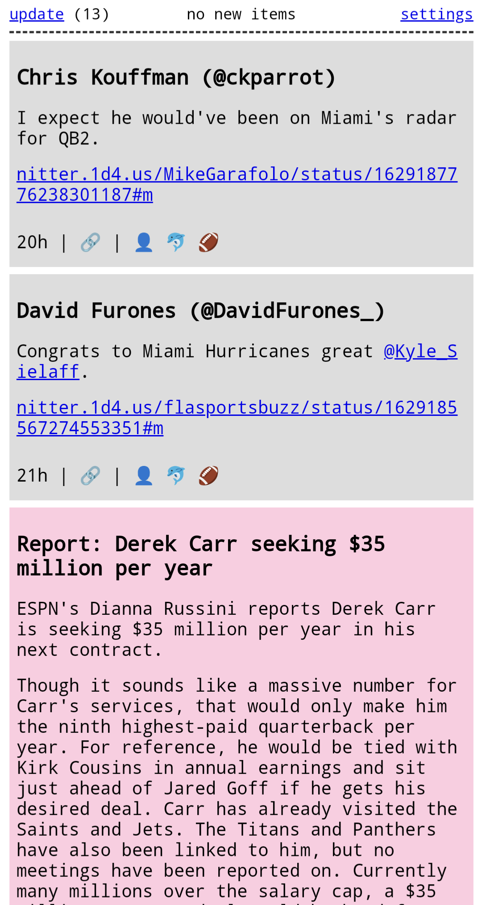

# feedn - a minimalist news aggregator

feedn is a minimalist news aggregator written in Clojure. At a glance:

  - No database or persistence. Everything is stored in an atom.
  - Human-friendly features to moderate your intake of news and social media:
      - Update limit: only allow a certain number of updates per day
      - Volume control: assign a volume level to each source, so that you can easily filter out "noisier" sources and focus on more important ones
  - Reads updates from:
      - Nitter
      - Rotoworld/NBC Sports Edge
      - Invidious
      - Dumpor
      - Substack
      - (and easily extensible to add other sources)

All subscriptions and settings are managed through `config.edn`. Example:

    {:subs
     {:sources
      {:nitter
       {:channels
        {"adamschefter" {:tags #{:football}}}}
       :rotoworld
       {:color "#ffcce1"
        :channels
        {"Headlines"
         {:url "https://www.nbcsportsedge.com/api/player_news?page%5Blimit%5D=10&sort=-initial_published_date&include=team,league,league.sport&filter%5Bsport_headline%5D=1&filter%5Bleague.meta.drupal_internal__id%5D=21"
          :tags #{:football}}}}
       :invidious
       {:color "#faffc7"
        :channels
        {"The QB School"
         {:invidious/channel-id "UCGfxHp2yuimtLsFaq1r7aIQ"
          :tags #{:football}}}}}}
     :tags
     {:football {:emoji "\uD83C\uDFC8"}}}

See `config.clj` for specs describing the structure of the config.
Note that some sources have their own source-specific config params (e.g. `:invidious/channel-id`).

To run:

    $ clj -M -m feedn.main config.edn

The web server will be running on `localhost:3000`.

Disclaimer: this project was developed for my own personal use. Do not expect any degree of reliablity or security.
